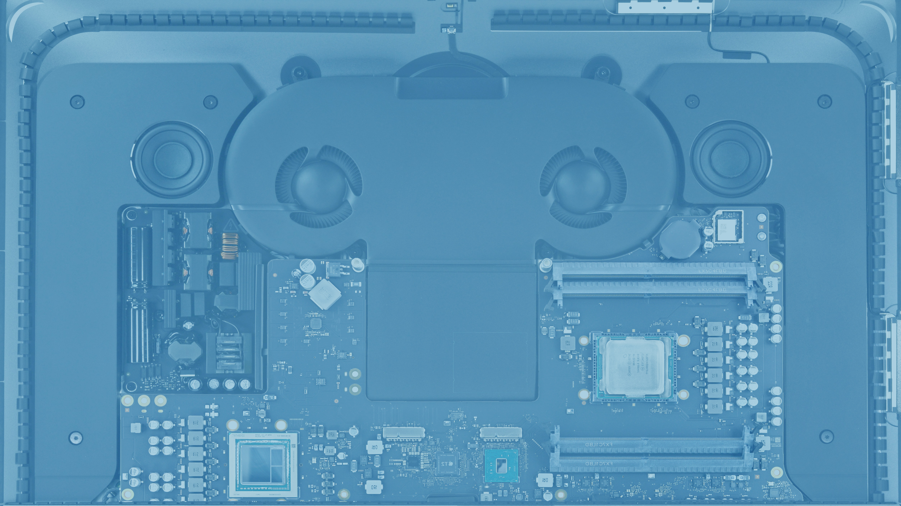

# Backdrop image for the iMac Pro

This is an "Inside out" backdrop image for your iMac Pro. It was made by using photos from the [iFixit teardown pages](https://www.ifixit.com/Teardown/iMac+Pro+Teardown/101807). Sharp eyed viewers will notice the motherboard has been flipped around to reveal the more interesting components normally facing away from you, and the (boring) heat sinks are removed.

The blue cast was added because seeing all the components on the screen was just to busy for day-to-day use.

Unfortunately the Photoshop source file is too large to post to GitHub (65MB). I'll post a link when I can find another place to publicly park it.
